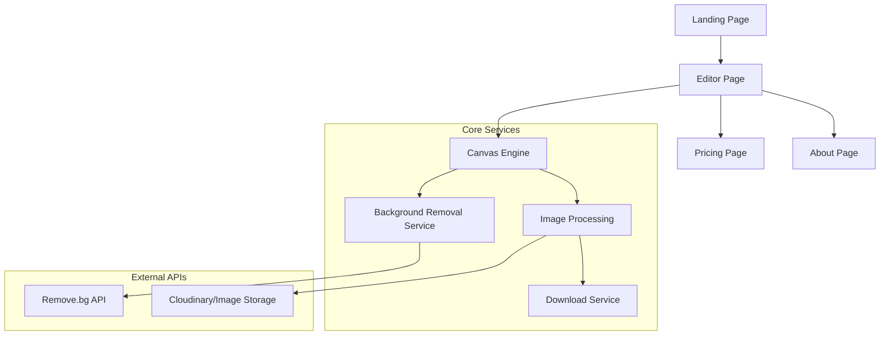

# Design Document

## Overview

The "Text Behind Image" application is a client-side web application built with React/Next.js that provides an intuitive interface for creating layered text effects. The application uses HTML5 Canvas for image manipulation and integrates with background removal APIs to create the "text behind subject" effect. The architecture prioritizes simplicity, performance, and future scalability.

## Architecture

### High-Level Architecture



### Technology Stack

- **Frontend Framework**: Next.js 14 with React 18
- **Styling**: Tailwind CSS for responsive design
- **Canvas Manipulation**: HTML5 Canvas API with Fabric.js for advanced text handling
- **Background Removal**: Remove.bg API (with fallback placeholder)
- **Image Processing**: Canvas API for compositing and export
- **State Management**: React Context API for editor state
- **File Handling**: Browser File API for uploads and downloads

## Components and Interfaces

### Core Components

#### 1. Layout Components
- **AppLayout**: Main application wrapper with navigation
- **Header**: Navigation bar with logo and menu items
- **Footer**: Contact info and legal links

#### 2. Page Components
- **LandingPage**: Hero section with CTA and demo preview
- **EditorPage**: Main editing interface with canvas and controls
- **PricingPage**: Current free features and future Pro plan
- **AboutPage**: Application description and information

#### 3. Editor Components
- **ImageUploader**: Drag-and-drop file upload zone
- **TextControls**: Font, size, color, and alignment controls
- **Canvas**: Interactive editing surface with drag-and-drop
- **ActionButtons**: "Place Behind" and "Download" buttons
- **PreviewPanel**: Shows processing status and results

#### 4. Utility Components
- **LoadingSpinner**: Processing feedback
- **ErrorMessage**: User-friendly error display
- **SuccessMessage**: Confirmation feedback

### Component Interfaces

```typescript
interface EditorState {
  image: HTMLImageElement | null;
  text: TextProperties;
  canvas: CanvasState;
  processing: boolean;
  error: string | null;
}

interface TextProperties {
  content: string;
  font: string;
  size: number;
  color: string;
  alignment: 'left' | 'center' | 'right';
  position: { x: number; y: number };
}

interface CanvasState {
  width: number;
  height: number;
  scale: number;
  backgroundRemoved: boolean;
}
```

## Data Models

### Image Processing Pipeline

1. **Upload Phase**
   - File validation (PNG/JPG, size limits)
   - Image loading and canvas initialization
   - Aspect ratio calculation and scaling

2. **Text Editing Phase**
   - Real-time text rendering on overlay layer
   - Property updates with immediate preview
   - Position tracking with drag handlers

3. **Background Removal Phase**
   - API call to Remove.bg service
   - Mask generation and validation
   - Layer composition preparation

4. **Composition Phase**
   - Text layer rendering behind subject
   - Final image generation
   - Export preparation

### File Structure

```
src/
├── components/
│   ├── layout/
│   │   ├── AppLayout.tsx
│   │   ├── Header.tsx
│   │   └── Footer.tsx
│   ├── pages/
│   │   ├── LandingPage.tsx
│   │   ├── EditorPage.tsx
│   │   ├── PricingPage.tsx
│   │   └── AboutPage.tsx
│   ├── editor/
│   │   ├── ImageUploader.tsx
│   │   ├── TextControls.tsx
│   │   ├── Canvas.tsx
│   │   ├── ActionButtons.tsx
│   │   └── PreviewPanel.tsx
│   └── ui/
│       ├── LoadingSpinner.tsx
│       ├── ErrorMessage.tsx
│       └── SuccessMessage.tsx
├── services/
│   ├── backgroundRemoval.ts
│   ├── imageProcessing.ts
│   └── downloadService.ts
├── hooks/
│   ├── useEditor.ts
│   ├── useCanvas.ts
│   └── useImageUpload.ts
├── utils/
│   ├── canvasUtils.ts
│   ├── imageUtils.ts
│   └── validation.ts
└── types/
    ├── editor.ts
    └── api.ts
```

## Error Handling

### Error Categories

1. **Upload Errors**
   - Invalid file format
   - File size too large
   - Corrupted image files
   - Network upload failures

2. **Processing Errors**
   - Background removal API failures
   - Canvas rendering errors
   - Memory limitations
   - Timeout errors

3. **Export Errors**
   - Canvas export failures
   - Browser download restrictions
   - File generation errors

### Error Handling Strategy

```typescript
interface ErrorHandler {
  handleUploadError(error: UploadError): void;
  handleProcessingError(error: ProcessingError): void;
  handleExportError(error: ExportError): void;
  displayUserFriendlyMessage(error: AppError): void;
}
```

### Fallback Mechanisms

- **Background Removal Fallback**: Manual masking tools if API fails
- **Canvas Fallback**: Basic overlay mode if advanced features fail
- **Export Fallback**: Alternative download methods for different browsers
- **Offline Mode**: Basic functionality without API dependencies

## Testing Strategy

### Unit Testing
- Component rendering and props handling
- Utility functions for image processing
- Canvas manipulation functions
- Error handling logic

### Integration Testing
- File upload and validation flow
- Text editing and preview updates
- Background removal API integration
- Download functionality

### End-to-End Testing
- Complete user workflow from upload to download
- Cross-browser compatibility
- Mobile responsiveness
- Error scenarios and recovery

### Performance Testing
- Large image handling
- Canvas rendering performance
- Memory usage optimization
- API response time handling

### Test Structure

```
tests/
├── unit/
│   ├── components/
│   ├── services/
│   └── utils/
├── integration/
│   ├── editor-workflow.test.ts
│   ├── api-integration.test.ts
│   └── file-handling.test.ts
└── e2e/
    ├── user-journey.spec.ts
    ├── mobile-responsive.spec.ts
    └── error-scenarios.spec.ts
```

## Responsive Design Considerations

### Breakpoints
- Mobile: 320px - 768px
- Tablet: 768px - 1024px
- Desktop: 1024px+

### Mobile Adaptations
- Touch-friendly drag and drop
- Simplified text controls
- Optimized canvas sizing
- Gesture support for zoom/pan

### Performance Optimizations
- Image compression for mobile
- Lazy loading for non-critical components
- Progressive enhancement for advanced features
- Efficient canvas rendering for lower-end devices